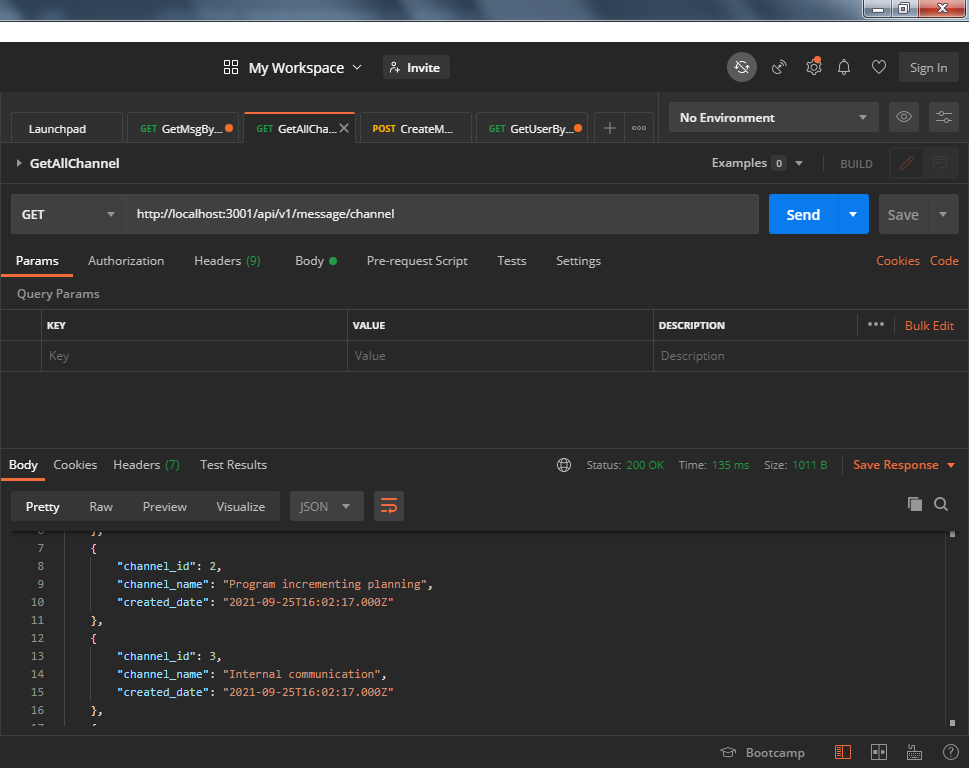
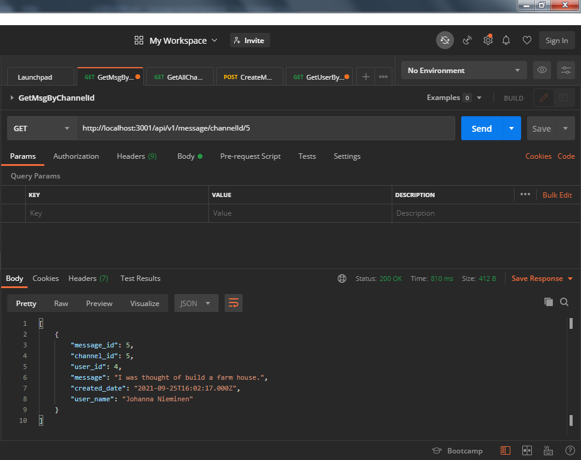
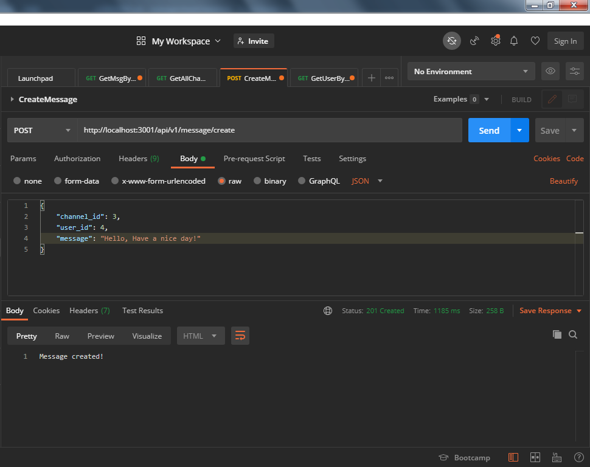
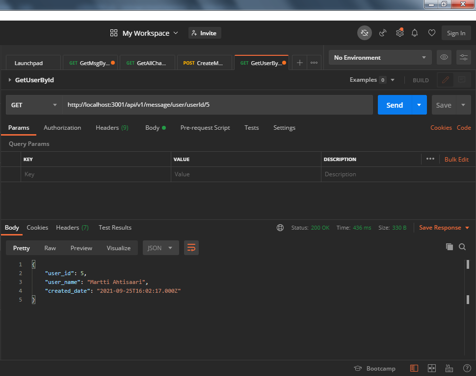

# message-board-backend
Message Board Application

This application is developed for providing services to message-board-frontend application.
This API is developed using ExpressJs & MySql. For make ease of development I have used nodemon.
Models are clearly seperated and created utils for field validations, error handling, modyfying exception, and to handle await errors.

This application comprises of two phases.
    1. message-board-backend
    Back-end has been developed using ExpressJs(cors, dotenv, express, express-validator, mysql2)
    Backend exposes the below services to frontend inorder to fetch channels, messages related to channel, create messages and fetch the user.
        i. http://localhost:3001/api/v1/message/channelId/1
        ii. http://localhost:3001/api/v1/message/channel
        iii. http://localhost:3001/api/v1/message/create
        iv. http://localhost:3001/api/v1/message/userId/5

    Github Link: https://github.com/subahanih/message-board-backend

    2. message-board-frontend
    Front-end has been developed using ReactJS(react, react-dom, react-icons, react-scripts, web-vitals)
    Please visit the below link to get front-end source code.

    Github Link: https://github.com/subahanih/message-board-frontend

### What is missing?
    ● Channel and message storage can be an in-memory database (global variable etc).
    I was facing difficulties to connect in memory database. Almost done but it was consuming most of the timings so I have dropped off. Finally I have used MySQL.

    ● On server start, storage is populated with a fixed set of empty channels
    Since I was not able to configure in memory database I couldn't load mock data automatically, instead, I have given MySql script "arc/database/create-message-db.sql". Tis would contain the required table and few mock-data as mentioned in the specification.

### What is completed? 
    ● GET endpoint for querying channels
        ○ GET http://<backend>/channels
    ● GET endpoint for querying channel’s messages
        ○ GET http://<backend>/messages/<channel>
    ● POST endpoint for submitting new messages to a channel
        ○ POST http://<backend>/<channel>
        ○ Body
            ■ Message text

### How to run (Please go through README.md for configuring message-board-backend)?
    1. npm int
    2. npm install
    3. Update .env file with respective DB details and port(message-board-backend/.env).
    4. Trigger the given SQL script in the MySql(message-board-backend/src/db/create-message-db.sql).
    3. npm start (Port has mentioned in the .env file as 3001)

### Backend view from the postman.
### To get all available channels. 

### To get a channel by channel ID.

### To create a new message.
To craete a new message channel ID, user ID and message must be required.
Expres Validator has been used, so if message is empty or not exist then API will throw a exception.
For the same other ID fields, if IDs are missing then validator will throw the exception.
Maximum 300 number characters can be allowed(Just I kept a range), if it crosses the 300 charaters then also validator will throw a exception. 

### To get a user details by ID.

